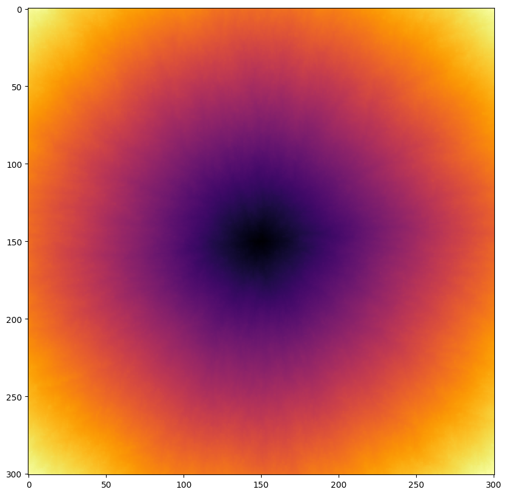

# first passage percolation

This package provides simulation tools for first passage percolation on the square lattice. See the [`example.ipynb`](example.ipynb) file for the usage of the package.

## Simple example

```python
import first_passage_percolation_sim as fpp
from scipy.stats import geom

(fpp.FirstPassagePercolation(size=201, dist=geom(0.5))
    .compute_lengths()
    .plot_heatmap(cmap="inferno")
)
```

<p align="center">

</p>

## Installation

```console
pip install first-passage-percolation-sim
```

## TODO's

- [ ] Testings
